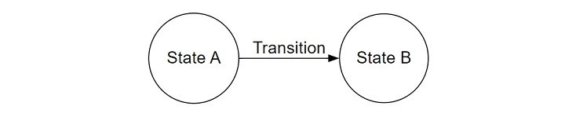
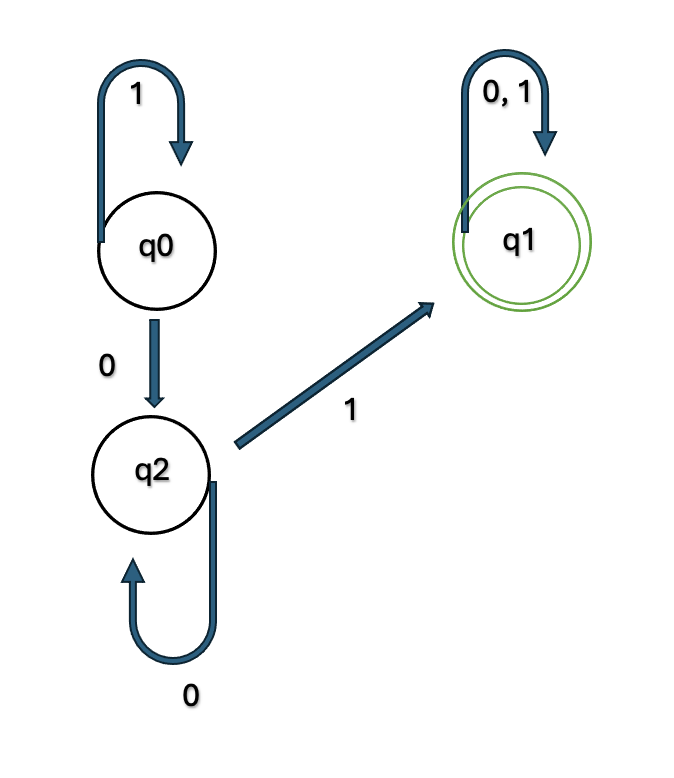
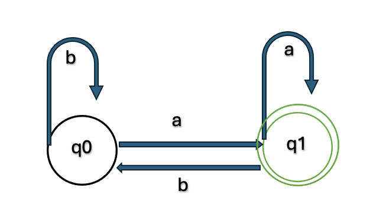

# Formal Languages, DFA, NFA, and Turing Machines

---

## 📘 Table of Contents

1. [Formal Languages](#1-formal-languages)
2. [Regular Languages](#2-regular-languages)
3. [Finite Automata](#3-finite-automata)
4. [Deterministic Finite Automata (DFA)](#4-deterministic-finite-automata-dfa)
5. [Nondeterministic Finite Automata (NFA)](#5-nondeterministic-finite-automata-nfa)
6. [Kleene’s Theorem](#6-kleenes-theorem)
7. [Pushdown Automata (PDA)](#7-pushdown-automata-pda)
8. [Turing Machines (TM)](#8-turing-machines)
9. [Finite Automata Summary Table](#9-finite-automata-summary-table)
10. [Key Takeaways for Exams](#10-key-takeaways-for-exams)

---

## 1. **Formal Languages**

A **formal language** is a set of strings formed from a specific alphabet, following specific rules.

### 🧩 Basic Terms

- **Symbol** – A single character (e.g., letter or digit)
- **Alphabet (Σ)** – A finite set of symbols
- **String** – A sequence of symbols from the alphabet
- **Language (L)** – A collection of strings over Σ

### 🧠 Examples

- Binary alphabet: `{0, 1}` → `010`, `111`, `1001`
- DNA alphabet: `{A, T, C, G}`

### 💡 Core Problems

- **Specification Problem** – Define the language precisely.
- **Recognition Problem** – Given a string `x`, decide whether `x ∈ L`.

---

## 2. **Regular Languages**

Languages that can be expressed using **Regular Expressions (REs)** or **Finite Automata**.

### ⚙️ Regular Operations

| Operation             | Symbol  | Meaning                      | Example                              |
| --------------------- | ------- | ---------------------------- | ------------------------------------ |
| Union                 | `R ∪ S` | Strings in either R or S     | `{a, ba} ∪ {ab, b} = {a, ba, ab, b}` |
| Concatenation         | `RS`    | Strings from R followed by S | `{a, ab}{ba} = {aba, abba}`          |
| Closure (Kleene Star) | `R*`    | Zero or more repetitions     | `R* = {ε, R, RR, RRR, ...}`          |

---

### 🧠 Regular Expressions (RE)

A **regular expression** defines a language using:

- **Union (`|`)**
- **Concatenation**
- **Closure (`*`)**
- **Parentheses (`( )`)**

💡 **A language is regular if it can be described by a regular expression.**

---

### 🧩 Extended Regex Syntax (Modern)

| Symbol         | Meaning                              |
| -------------- | ------------------------------------ |
| `.`            | Matches any character                |
| `^`, `$`       | Match beginning or end of line       |
| `[abc]`        | Matches any listed symbol            |
| `[^abc]`       | Matches any symbol _not_ in the list |
| `+`            | One or more repetitions              |
| `?`            | Zero or one repetition               |
| `{n}`, `{m,n}` | Specific or range of repetitions     |

🧠 Example:  
`^[A-Za-z0-9_]+$` → Matches valid variable names.

---

### 💻 Regular Expressions in Java

- **Recognition:** `s.matches(re)` → returns `true` if string `s` matches regex `re`.
- **Validation:** `Validate.java` → checks strings against regex patterns.
- **Searching:** `Grep.java` → prints all lines containing substrings matching regex.

---

## 3. **Finite Automata**

A **Finite Automaton (FA)** is an abstract machine that reads input strings and determines whether they belong to a specific language.

### ⚙️ Components

- **Q** → Set of finite states
- **Σ** → Input alphabet
- **δ** → Transition function
- **q₀** → Start state
- **F** → Accept (final) states

Formally:  
`FA = {Q, Σ, δ, q₀, F}`

---

### 🧠 What Is an Automaton?

An **automaton** is a rule-based system that processes inputs and changes states automatically — like a machine reacting to signals.

#### Types of Automata

1. **Finite Automata (FA)** – Recognizes _regular_ languages.
2. **Pushdown Automata (PDA)** – Has a stack; recognizes _context-free_ languages.
3. **Turing Machine (TM)** – Has infinite tape; recognizes _computable_ languages.
4. **Linear Bounded Automata (LBA)** – Like a Turing Machine but with limited tape.
5. **Cellular Automata (CA)** – Grid-based systems evolving by simple local rules.

---



### 💡 Deterministic vs Non-deterministic Automata

| **Aspect**            | **DFA**                           | **NFA**                                    |
| --------------------- | --------------------------------- | ------------------------------------------ |
| **State Transitions** | One possible next state per input | Multiple possible next states              |
| **Empty (ε) Moves**   | Not allowed                       | Allowed                                    |
| **Predictability**    | Fully predictable                 | Can follow multiple paths                  |
| **Start State**       | Only one                          | May have several                           |
| **Word Acceptance**   | Accepts if final state reached    | Accepts if _any_ path leads to final state |

---

## 4. **Deterministic Finite Automata (DFA)**

A **DFA** is a finite automaton where:

- Each state has _exactly one_ transition for every input symbol.
- No ε-transitions.
- Accepts a string if it ends in an accepting state.



### ⚙️ Example — Strings ending in “01”

```
Σ = {0, 1}
Q = {q0, q1, q2}
F = {q1}
Transitions:
q0 -0-> q2
q0 -1-> q0
q2 -0-> q2
q2 -1-> q1
q1 -0-> q1
q1 -1-> q1
```

✅ Accepts: `01`, `001`, `101`, `1101`, `010`  
❌ Rejects: `0`, `1`, `00`, `111`

---

### ⚙️ Another Example

```
Σ = {a, b}
Q = {q0, q1}
F = {q1}
Transitions:
q0 -a-> q1
q0 -b-> q0
q1 -a-> q1
q1 -b-> q0
```

✅ Accepts: `a`, `ba`, `bba`  
❌ Rejects: `b`, `abb`

---

## 5. **Nondeterministic Finite Automata (NFA)**

An **NFA** allows:

- Multiple transitions for the same input.
- Optional ε-moves (empty transitions).
- Acceptance if _any_ path leads to an accepting state.



### ⚙️ Example — Strings ending in “a”

```
Σ = {a, b}
Q = {q0, q1}
F = {q1}
Transitions:
q0 -a-> {q0, q1}
q0 -b-> {q0}
```

✅ Accepts: `a`, `ba`, `bba`

---

### 💡 DFA vs NFA Summary

| Feature               | DFA             | NFA                      |
| --------------------- | --------------- | ------------------------ |
| Transitions per input | Exactly 1       | 0, 1, or many            |
| ε-transitions         | Not allowed     | Allowed                  |
| Determinism           | Yes             | No                       |
| Recognition Power     | Same            | Same                     |
| Conversion            | Every NFA → DFA | Possible but more states |

---

## 6. **Kleene’s Theorem**

💡 **Kleene’s Theorem:**  
Regular expressions, DFAs, and NFAs are **equivalent** — they describe the same class of **regular languages**.

### ⚙️ Implications

- Any **RE → NFA → DFA** equivalently.
- Java’s regex engine internally builds and simulates an NFA.
- Some languages (like equal numbers of `a` and `b`) are **not regular**.

---

## 7. **Pushdown Automata (PDA)**

A **PDA** = DFA + Stack → allows memory for nested structures.

- Recognizes **context-free languages**, such as balanced parentheses.


### 💡 Example

Used to verify code with balanced parentheses.  
If input violates grammar, the PDA rejects it.

---

## 8. **Turing Machines**

The most powerful abstract model — basis of modern computing.

### ⚙️ Characteristics

- **Infinite tape** divided into cells.
- **Read/Write head** moves left or right.
- **Finite set of states** and **transition rules**.
- Reads → writes → moves → changes state.

### 🧠 Capabilities

- Simulates _any_ algorithm.
- Recognizes all **recursively enumerable languages**.

---

## 9. **Finite Automata Summary Table**

| Type | Memory        | ε-Moves | Deterministic | Recognizes               |
| ---- | ------------- | ------- | ------------- | ------------------------ |
| DFA  | None          | No      | Yes           | Regular languages        |
| NFA  | None          | Yes     | No            | Regular languages        |
| PDA  | Stack         | Yes     | No            | Context-free languages   |
| TM   | Infinite tape | Yes     | No            | All computable languages |

---

## 10. **Key Takeaways for Exams**

🧠 **Summary**

- **Formal Language** – Set of valid strings defined by rules.
- **Regular Expression ↔ DFA/NFA ↔ Regular Language** (Kleene’s Theorem).
- **DFA** – One transition per input; no ε-moves.
- **NFA** – Multiple possible transitions; accepts if _any_ path works.
- **PDA** – Adds stack memory for nested patterns.
- **Turing Machine** – Adds full memory and logic; models real computation.

💡 **Tip:**  
Always remember — DFA ⊂ NFA ⊂ PDA ⊂ TM (in terms of computational power).

---
