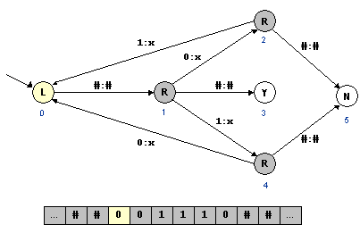

# 5.3 Universality

---

## **Overview**

One of the crowning achievements of the 20th century was the **formalization of computation**. The central question it addresses is: **What is computable in this universe?**  
The surprising revelation: a **general-purpose computer** is capable of performing _any_ computation that any other computer can perform. This universality is one of the most important ideas in all of computer science.

Universal computation ignited the **Computer Revolution**. Because computers are universal, they could quickly adapt to new technologies like the **World Wide Web**, **MP3 files**, and **digital photography**—without needing entirely new machines. Once software and protocols were created, existing hardware could immediately run them.  
This stands in contrast to most physical technologies—for instance, there’s no universal cooking device. But there _is_ a universal computing machine capable of processing numbers, text, sound, and images alike.

---

## **The Universal Turing Machine (UTM)**

A **Universal Turing Machine** (UTM) is a Turing machine that can simulate the behavior of _any_ other Turing machine, including itself. This means that there exists a single Turing machine capable of running _any algorithm_.

The key insight: **the description of a Turing machine itself can be treated as data**. A UTM can read this description along with the original machine’s input and simulate it step-by-step.

For example, the following diagram represents a Turing Machine that checks for equal numbers of `0`s and `1`s:



We can encode the Turing machine as a table:

```
0 L
1 R
2 R
3 Y
4 R
5 N
0 1 # #
2 0 1 x
4 0 0 x
1 2 0 x
1 3 # #
1 4 1 x
2 5 # #
4 5 # #
```

This table can then be concatenated into a single string, representing the program and its input, and loaded onto the tape of a Universal Turing Machine.

The UTM then **interprets** this string—executing the represented Turing Machine’s algorithm on its input.  
This was Alan Turing’s profound insight: _a single machine can execute any algorithm by treating programs as data._

---

## **General Purpose Computers**

The idea of a general-purpose machine was first articulated by **Ada Lovelace**, who described Charles Babbage’s _Analytic Engine_ as a device for “developing and tabulating any function whatever.”  
Modern computers embody this idea through the **von Neumann architecture**, where **programs and data are stored in the same memory**. This design mirrors the UTM—where both the machine description (program) and its input coexist on the same tape.

Thus, general-purpose computers are **physical realizations** of Universal Turing Machines.

---

## **The Church–Turing Thesis**

Proposed independently by **Alonzo Church** and **Alan Turing (1936)**, the **Church–Turing Thesis** asserts:

> Anything that can be computed by a mechanical process can be computed by a Turing machine.

Turing and Church proposed different models—**Turing machines** and **lambda calculus**—yet both were shown to be equivalent in computational power.

This thesis unifies computation under a single principle: if a process can be mechanized, a Turing machine can simulate it.  
It also implies that if something _cannot_ be done by a Turing machine, it cannot be computed by _any_ physically realizable process.

---

## **Universality of Computation**

The Church–Turing thesis implies **universality** among different models of computation.  
Adding features such as multiple tapes, multiple heads, or randomness does not make a machine more powerful in terms of _what it can compute_—only in how efficiently it computes.

### Examples of Equivalent Variants

| **Modified Turing Machine** | **Description**                                  |
| --------------------------- | ------------------------------------------------ |
| Multiple Heads              | Two or more tape heads operating independently   |
| Multiple Tapes              | Two or more separate tapes                       |
| Multidimensional Tape       | Two-dimensional tape surface                     |
| Nondeterministic            | NFA controls transitions instead of DFA          |
| Probabilistic               | Random transitions with majority acceptance rule |
| Editable                    | Can insert and delete symbols                    |

Even with restrictions—like a binary alphabet or a one-way tape—Turing machines retain the same computational power.

---

## **Equivalent Models of Computation**

Over time, many computational models have been shown to be equivalent to Turing machines, strengthening the **Church–Turing thesis**.

| **Model**                       | **Description / Origin**                                                       |
| ------------------------------- | ------------------------------------------------------------------------------ |
| **Post Formal Systems**         | (Emil Post, 1920s) – String replacement rules for formal proofs                |
| **Lambda Calculus**             | (Alonzo Church, 1936) – Foundation of functional programming                   |
| **General Recursive Functions** | (Gödel, Herbrand) – Computation on natural numbers                             |
| **Markov Algorithms**           | (Andrei Markov, 1960) – Sequential string replacements                         |
| **Unrestricted Grammars**       | (Noam Chomsky, 1950s) – Models of natural language                             |
| **Cellular Automata**           | (Von Neumann, Conway, 1950s–60s) – Grid-based computation (e.g., Game of Life) |
| **Random Access Machines**      | Modern CPUs with addressable memory                                            |
| **Programming Languages**       | Java, Python, C++, Lisp – All Turing complete                                  |
| **Quantum Turing Machines**     | (Deutsch, 1985) – Uses quantum states for computation                          |

All of these are **Turing-complete**, meaning they can compute exactly the same class of functions.

---

## **Interactive & Physical Computation**

Modern systems often involve **interaction** with external inputs—such as users, sensors, or networks.  
While traditional Turing machines do not model this interactivity directly, it can be simulated by extending the Turing model with input/output streams.

### **Computation and Physics**

Turing machines assume infinite memory and perfect reliability, but real computers obey **physical limits**:

- The **speed of light** limits how fast information can propagate.
- The **amount of information** storable in a finite space is bounded (Holographic principle).
- Physical systems can still realize logic operations (AND, OR, FAN-OUT).

Deutsch’s **Church–Turing Principle** extends this view:

> The universe is capable of containing a universal machine that can simulate the universe itself.

---

## **Beyond the Church–Turing Thesis**

Some theoretical models go beyond standard Turing computation, exploring **hypercomputation**:

- **Oracle Turing Machines** – Machines that can answer questions like the Halting Problem.
- **Real-Valued Turing Machines** – Manipulate real numbers with infinite precision.
- **Probabilistic and Quantum Turing Machines** – Harness randomness or quantum effects.

These are not known to violate the Church–Turing thesis since no such physically realizable machines exist today.

---

## **Key Takeaways**

- A **Universal Turing Machine** can simulate any other machine.
- **General-purpose computers** are real-world implementations of this idea.
- The **Church–Turing Thesis** defines the limits of what is computable.
- **All Turing-complete models** are equivalent in computational power.
- **Hypercomputation** explores what might exist beyond these theoretical limits.
