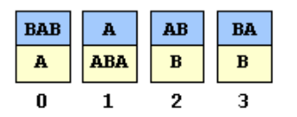
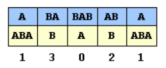
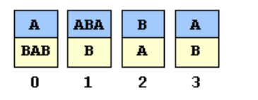

# 5.4 Computability

---

## **Overview**

In 1900, **David Hilbert** famously asserted that every mathematical problem could be solved by a finite sequence of logical steps. However, as computer science developed, researchers discovered that **some problems are fundamentally unsolvable**—no algorithm can ever solve them, no matter how powerful the computer.

A problem is **solvable** if an algorithm exists to compute the correct result for all valid inputs. Otherwise, it is **unsolvable**. Unsolvable problems occur in many fields—mathematics, logic, physics, compiler theory, chaos theory, and computer science.

---

## **The Halting Problem**

The **Halting Problem** is the most famous unsolvable problem. Its question:
> Given a program and its input, will the program eventually halt (finish), or run forever?

This problem was proven **unsolvable by Alan Turing (1936)**. Even simple programs can display extremely complex behavior. For example, so-called **busy beaver** Turing machines (machines that write as many 1’s as possible before halting) can produce enormous output even with very few states.


The image above shows an 8-state Turing machine that halts after **47,176,870 steps**, leaving **4,098 ones** on the tape.

Even with extensive computation, **no general algorithm can determine whether an arbitrary Turing machine halts.**

---

## **Halting Problem in Java**

In programming terms, imagine trying to write a Java program `Halt.java` that could predict whether another program `mystery(x)` halts for input `x`.

Example: `Perfect.java` searches for an odd perfect number. Mathematicians don’t know whether such a number exists—it could run forever or halt after a huge number of steps. There’s **no way to know in advance**.

If such a tool existed, compilers could automatically warn about infinite loops. But this is **impossible**—the halting problem proves that no such program can exist for all cases.

---

## **Proof of Unsolvability (Informal Sketch)**

The proof uses **self-reference** and **contradiction** (similar to the paradox “This statement is false”).

1. Suppose a perfect `Halt(P, x)` function exists that returns `true` if program `P` halts on input `x`, and `false` otherwise.
2. Construct a new program `Strange(P)` that does the opposite:
   ```java
   if (Halt(P, P) == true)
       while (true);  // infinite loop
   ```
3. Now run `Strange(Strange)`.

   - If `Strange(Strange)` halts → contradiction, because it was designed not to.
   - If it doesn’t halt → contradiction, because it was designed to halt.

Thus, no such `Halt()` program can exist. The **Halting Problem is unsolvable**.

This reasoning is an example of **diagonalization**—a powerful logical technique used by Cantor and Gödel.

---

## **Consequences of the Halting Problem**

Because the Halting Problem is undecidable:
- There’s no general rule to guarantee whether an arbitrary program terminates.
- Many related problems are also **undecidable**, such as:
  - **Totality Problem:** Does a program halt on all inputs?
  - **Program Equivalence:** Do two programs produce the same outputs for all inputs?
  - **Dead Code Elimination:** Will a certain line of code ever execute?
  - **Variable Initialization:** Is a variable always initialized before use?
  - **Memory Management:** Will a variable ever be referenced again?

These results explain why **debugging and compiler optimization are hard**—they often involve undecidable questions.

---

## **Other Unsolvable Problems**

### **Rice’s Theorem**
Any **nontrivial property** of the input/output behavior of a Turing machine is undecidable.

### **Chaitin’s Number (Ω)**
The probability that a random program halts is **uncomputable**.

### **Hilbert’s 10th Problem**
> Determine if a multivariable polynomial has an integer root.

For example, \( f(x, y, z) = 6x^3yz^2 + 3xy^2 - x^3 - 10 \) has an integer root, but \( x^2 + y^2 - 3 = 0 \) does not.

Yuri Matiyasevich (1970) proved this problem **unsolvable**. No general algorithm can determine whether an arbitrary polynomial has an integer root.

### **Post’s Correspondence Problem (PCP)**
A classic unsolvable puzzle:
> Given a set of cards, each with a top and bottom string, can we arrange copies of them to make the top and bottom strings identical?

Example (yes instance):



**Solution using cards 1, 3, 0, 2, 1:**



Example (no instance):



No card’s leftmost symbols match, so no sequence is possible. Determining whether a match exists is **unsolvable**.

### **Program Equivalence Problem**
Determining if two programs always produce identical outputs for identical inputs is **undecidable**.

### **Virus Recognition**
Fred Cohen formally proved that determining whether a given program is a computer virus is **unsolvable**.

---

## **Mathematical and Logical Connections**

### **Computable Numbers**
A number is **computable** if there exists an algorithm that can generate its digits. Examples include:
- All integers and rationals
- \( \sqrt{2} \), \( \pi \), \( e \), and trigonometric constants

Most real numbers, however, are **not computable**, since there are uncountably many reals but only countably many algorithms.

### **Gödel’s Incompleteness Theorem**
In 1931, **Kurt Gödel** proved that any sufficiently powerful formal mathematical system is either:
- **Incomplete** (some true statements cannot be proven), or
- **Inconsistent** (some false statements can be proven true).

This anticipated Turing’s result on undecidability.

---

## **Philosophical and Practical Implications**

- There exist **problems no computer (or human, if the brain is mechanical)** can solve.
- Computability defines the **limits of logic and machine intelligence**.
- Even though most real-world problems we face are decidable, **undecidability reminds us of the boundaries of computation.**

> “To know what a program actually does, you must run it.” – (Computability Insight)

---

## **Key Takeaways**

- Some problems are **unsolvable**, not just practically difficult.
- The **Halting Problem** is the foundational example of an undecidable problem.
- **Rice’s Theorem** generalizes undecidability to all nontrivial program properties.
- Many fields—math, logic, physics—contain undecidable questions.
- Computability theory reveals **the fundamental limits of computation and reasoning.**