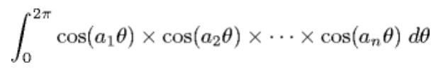

# 5.5 Intractability

---

## **Overview**

The goal of **complexity theory** is to understand the nature of efficient computation — which problems can be solved quickly, and which cannot. In Section 4.1, we analyzed algorithms by measuring how their running time grows with input size. In this section, we explore a class of problems for which no one has found an efficient (polynomial-time) algorithm.

> **Intractable problems** are problems that cannot be solved in polynomial time by any known algorithm.

A nice YouTube video on **P = NP**: [https://www.youtube.com/watch?v=YX40hbAHx3s](https://www.youtube.com/watch?v=YX40hbAHx3s)

## **Computational Complexity**

In the 1960s, **Hartmanis** and **Stearns** introduced the idea of measuring the _time_ and _memory_ needed by a Turing machine as a function of the input size. They defined **complexity classes** (such as P, NP, PSPACE, etc.) and proved that some problems have **inherent complexity** that cannot be reduced by clever programming.

They also proved the **time hierarchy theorem**, which formalized the intuition that giving a machine more time (or memory) allows it to solve strictly more problems.

> Computational complexity studies how much _time_, _space_, or _resources_ are needed to solve a problem — not just by one algorithm, but by any possible algorithm.

---

## **Polynomial vs. Exponential Time**

When analyzing algorithms, we distinguish between those that grow **polynomially** (tractable) and those that grow **exponentially** (intractable).

- **Polynomial-time algorithms** have running times like: \( N \log N, N^2, N^3, \dots \)
- **Exponential-time algorithms** have running times like: \( 2^N, N!, 3^N, \dots \)

### **Example:**

A brute-force **Traveling Salesman Problem (TSP)** algorithm might require \( N! \) steps. Even if every atom in the universe worked as a supercomputer, it couldn’t solve large instances of TSP.

> **Exponential growth** outpaces any improvement in hardware technology.

Thus, we say that a problem is **intractable** if there is no known polynomial-time algorithm to solve it.

---

## **Complexity Classes**

### **P (Polynomial Time)**

The class **P** contains all search problems that can be solved in polynomial time on a **deterministic Turing machine**.

Examples include:

| Problem    | Description                                  | Algorithm            | Example                           |
| ---------- | -------------------------------------------- | -------------------- | --------------------------------- |
| **GCD**    | Find greatest common divisor of two numbers  | Euclid’s Algorithm   | 34, 51 → 17                       |
| **STCONN** | Find a path between nodes s and t in a graph | BFS / DFS            | –                                 |
| **SORT**   | Sort a list of numbers                       | MergeSort            | [2.3, 8.5, 1.2] → [1.2, 2.3, 8.5] |
| **LSOLVE** | Solve \( Ax = b \) for x                     | Gaussian Elimination | –                                 |
| **LP**     | Linear programming                           | Ellipsoid algorithm  | –                                 |

### **NP (Nondeterministic Polynomial Time)**

A problem is in **NP** if:

1. Given a candidate solution, we can **verify** it in polynomial time.
2. Finding the solution might take more time, but _checking_ it is efficient.

Examples:

- **Linear equations:** Verify \( A x = b \)
- **Linear inequalities:** Verify \( A x \le b \)
- **Integer programming:** Verify integer solutions satisfy inequalities

---

## **The Extended Church–Turing Thesis**

Proposed by **Cobham** and **Edmonds** in the 1960s, it states:

> The Turing machine is as efficient as any physically realizable computing device.

That means any computation performed by real hardware can be simulated on a Turing machine with only a **polynomial slowdown**.

This has profound implications:

- Improving computer speed does not change which problems are tractable.
- **P** represents the set of problems solvable efficiently in our universe.

---

## **The P vs NP Question**

One of the most famous open problems in computer science:

> **Is P = NP?**

- **If P = NP:** Every efficiently _verifiable_ problem can also be efficiently _solved_.
- **If P ≠ NP:** Some problems are easy to check but hard to solve.

The **Clay Mathematics Institute** offers a **$1 million prize** for solving this question.

Most researchers believe **P ≠ NP**, but no proof exists yet.

Gödel himself anticipated this question in a 1956 letter to von Neumann, suggesting that if satisfiability were solvable efficiently, machines could replace mathematicians for “yes/no” problems.

---

## **Reductions**

**Reduction** is a fundamental concept in computational complexity. It allows us to show that one problem is at least as hard as another.

> Problem X reduces to Problem Y if any instance of X can be transformed into an instance of Y in polynomial time.

If we can efficiently reduce every NP problem to one problem Y, then Y is **NP-complete**.

---

## **NP-Completeness**

A problem is **NP-complete** if:

1. It is in NP, and
2. Every NP problem can be reduced to it in polynomial time.

The first NP-complete problem, **Boolean Satisfiability (SAT)**, was proven by **Cook (1971)** and **Levin (1973)**.

> If we can solve any NP-complete problem efficiently, then **P = NP**.

Since then, thousands of NP-complete problems have been discovered across computer science, physics, biology, and mathematics.

---

## **Examples of NP-Complete Problems**

### **1. Boolean Satisfiability (SAT)**

Given Boolean variables \( x_1, x_2, \dots, x_N \), determine if there exists a truth assignment that makes a logical formula true.

Example:
\[
(x_1' + x_2 + x_3)(x_1 + x_2' + x_3)(x_2 + x_3)(x_1' + x_2' + x_3')
\]

✅ Satisfiable when \( (x_1, x_2, x_3) = (T, T, F) \).

---

### **2. 3-SAT**

A variant of SAT where each clause has exactly three literals.

---

### **3. Clique Problem**

Given a graph, does there exist a subset of \( k \) vertices such that every two are connected by an edge?

---

### **4. Knapsack Problem**

Given \( n \) items with weights \( w_i \) and benefits \( b_i \), can we choose a subset that fits within a weight limit \( W \) and achieves a minimum benefit \( B \)?

---

### **5. Subset Sum / Partition**

Given integers, does a subset sum to a specific target value? Partition asks if the integers can be split into two equal-sum groups.

---

### **6. Integer Linear Programming**

Find integer solutions \( x \) such that \( A x \le b \). Contrasts with linear programming, which is solvable in P.

---

### **7. Protein Folding (HP Model)**

Proteins are modeled as 0s (hydrophilic) and 1s (hydrophobic). The goal is to fold the sequence in a way that minimizes energy (adjacent pairs of 1s not consecutive in the sequence).

Example:

> Minimizing the energy in this model is NP-hard.

---

### **8. Integration Problem**

Given integers \( a_1, a_2, \dots, a_N \), does the following integral equal 0?

\[
\int_0^{2\pi} \cos(a_1\theta) \cos(a_2\theta) \dots \cos(a_N\theta)\, d\theta
\]

This type of integral arises in physics and is **unsolvable** in general.

---

## **Coping with Intractability**

When faced with NP-complete problems, we often relax one or more of the following constraints:

1. Guarantee of polynomial-time performance
2. Guarantee of finding the optimal solution
3. Guarantee of solving all instances

### **Strategies:**

- **Heuristics:** Fast methods that work well in practice but don’t guarantee optimality (e.g., simulated annealing, genetic algorithms).
- **Approximation algorithms:** Provide solutions close to optimal (e.g., Arora’s TSP algorithm guarantees within 1% of the best solution).
- **Special cases:** Restrict the problem to instances that can be solved efficiently.
- **Exploiting hardness:** In cryptography, intractability ensures security.

---

## **Beyond NP-Completeness**

While most problems fall into **P**, **NP**, or **NP-complete**, other important classes exist:

| **Class**          | **Definition**                   | **Example Problems**           |
| ------------------ | -------------------------------- | ------------------------------ |
| **PSPACE**         | Solvable with polynomial space   | Games like Othello, Hex        |
| **EXPTIME**        | Solvable in exponential time     | Chess, Go                      |
| **EXPSPACE**       | Solvable in exponential space    | Regular expression equivalence |
| **DOUBLE-EXPTIME** | Requires double-exponential time | Presburger arithmetic          |

> **Savitch’s Theorem:** PSPACE = NPSPACE

---

## **Other Computational Classes**

- **#P:** Counting the number of solutions (e.g., number of satisfying assignments).
- **PPAD:** Problems guaranteed to have solutions (e.g., Nash equilibria).
- **FP / FNP:** Function and search problem analogs of P and NP.
- **Circuit Complexity:** Measures resources needed to compute Boolean functions.

---

## **Analog and Quantum Computation**

### **Analog Computers**

Any physical system with continuous values (e.g., soap bubbles, electrical systems) can in theory compute. The **Strong Church–Turing Thesis** (Vergis, Steiglitz, Dickinson) claims:

> Any finite analog computer can be simulated efficiently by a digital computer.

### **Quantum Computers**

Quantum systems leverage **superposition** and **entanglement** to perform computations beyond classical limits.

- **Shor’s Algorithm:** Factors integers in \( N^3 \) time.
- **Grover’s Algorithm:** Searches \( N \) items in \( \sqrt{N} \) time.

Quantum computing may challenge the Extended Church–Turing Thesis but does not yet violate it.

---

## **Key Takeaways**

- **P:** Efficiently solvable problems
- **NP:** Efficiently verifiable problems
- **NP-Complete:** Hardest problems in NP
- **Intractable problems** have no known polynomial-time solutions
- **Quantum computing** and **analog models** explore computation beyond classical Turing limits
