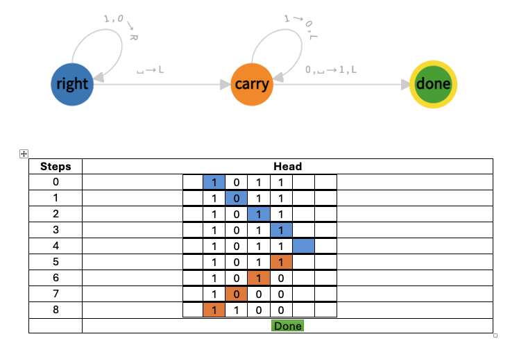

# Turing Machines

---

## 📘 Table of Contents

- [Turing Machines](#turing-machines)
  - [📘 Table of Contents](#-table-of-contents)
  - [1. **Overview**](#1-overview)
    - [💡 Why It Matters](#-why-it-matters)
  - [2. **Key Components**](#2-key-components)
    - [🧾 1. **Tape**](#-1-tape)
    - [⚙️ 2. **Tape Head**](#️-2-tape-head)
    - [🧠 3. **Control Unit (Finite-State Machine)**](#-3-control-unit-finite-state-machine)
  - [3. **Execution Process**](#3-execution-process)
    - [⚙️ How a TM Runs](#️-how-a-tm-runs)
    - [🧩 Example — Adding 1 to a Binary Number](#-example--adding-1-to-a-binary-number)
      - [🧠 States](#-states)
      - [⚙️ Transition Rules](#️-transition-rules)
      - [🧮 Example Run](#-example-run)
  - [4. **Computation Concepts**](#4-computation-concepts)
    - [🔁 Repetition (Loops)](#-repetition-loops)
    - [🔀 Conditional Branching](#-conditional-branching)
    - [♾️ Non-Termination](#️-non-termination)
  - [5. **Example — Unary to Binary Conversion**](#5-example--unary-to-binary-conversion)
    - [⚙️ Input Alphabet](#️-input-alphabet)
    - [💡 Description](#-description)
    - [🧠 Process Overview](#-process-overview)
  - [6. **Algorithm Logic (Increment by 1)**](#6-algorithm-logic-increment-by-1)
  - [7. **Java Implementation Notes**](#7-java-implementation-notes)
    - [🧾 `Tape.java`](#-tapejava)
    - [⚙️ `State.java`](#️-statejava)
    - [🔁 `Transition.java`](#-transitionjava)
    - [🧠 `TuringMachine.java`](#-turingmachinejava)
  - [8. **Non-Terminating Turing Machines**](#8-non-terminating-turing-machines)
  - [9. **Philosophical Significance**](#9-philosophical-significance)
  - [10. **Summary Table**](#10-summary-table)
  - [11. **Key Takeaways for Exams**](#11-key-takeaways-for-exams)

---

## 1. **Overview**

A **Turing Machine (TM)** is a simple but powerful abstract model of computation that can simulate any algorithm.  
Introduced by **Alan Turing (1936)**, it forms the **foundation of theoretical computer science**.

### 💡 Why It Matters

- Defines what is _computable_ and _non-computable_.
- Forms the basis for all modern computer architectures.
- Demonstrates that certain problems are **unsolvable**.

---

## 2. **Key Components**

A Turing Machine consists of:

### 🧾 1. **Tape**

- Infinite in both directions.
- Divided into **cells**, each containing a symbol from a **finite alphabet** (e.g., `{0, 1, #, A, X}`).
- Serves as memory — stores input, intermediate results, and output.

### ⚙️ 2. **Tape Head**

- Reads and writes one cell at a time.
- Moves **Left (L)** or **Right (R)** by one cell after each operation.
- The **active cell** determines the machine’s next action.

### 🧠 3. **Control Unit (Finite-State Machine)**

- Functions like a **CPU**, following predefined rules.
- Each transition rule is defined as:

```
(current_state, read_symbol) → (new_symbol, move_direction, next_state)
```

**Direction symbols:**

- **L** → Move Left
- **R** → Move Right
- **Y** → Accept (Yes)
- **N** → Reject (No)
- **H** → Halt

---

## 3. **Execution Process**

### ⚙️ How a TM Runs

1. Begin in the **initial state**.
2. Read the **current tape symbol**.
3. Follow the **transition rule**:
   - Write a new symbol
   - Move left/right
   - Switch to the next state
4. Repeat until the machine reaches **Halt (H)**, **Accept (Y)**, or **Reject (N)**.

If no rule applies for a given combination, the machine stops.

---

### 🧩 Example — Adding 1 to a Binary Number

This Turing Machine adds **1** to a binary number on the tape.  
It scans rightward, performs the addition, then halts.



#### 🧠 States

| **State** | **Meaning**                                   |
| --------- | --------------------------------------------- |
| **right** | Moves to the end of the binary number.        |
| **carry** | Performs the addition and handles carry-over. |
| **done**  | Halting state — computation finished.         |

#### ⚙️ Transition Rules

| **Current State** | **Read** | **Write** | **Move** | **Next State** | **Description**                  |
| ----------------- | -------- | --------- | -------- | -------------- | -------------------------------- |
| `right`           | `1`      | `1`       | `R`      | `right`        | Move right past 1                |
| `right`           | `0`      | `0`       | `R`      | `right`        | Move right past 0                |
| `right`           | `⊔`      | `⊔`       | `L`      | `carry`        | End of number found              |
| `carry`           | `1`      | `0`       | `L`      | `carry`        | 1 + 1 = 0 (carry continues)      |
| `carry`           | `0`      | `1`       | `L`      | `done`         | 0 + 1 = 1 (carry ends)           |
| `carry`           | `⊔`      | `1`       | `L`      | `done`         | No bits left; write 1 and finish |

#### 🧮 Example Run

**Input:** `1011`  
**Steps:**

1. Move right until blank.
2. Switch to `carry`.
3. Add 1 → last bit flips from `1` to `0`.
4. Continue carry until a `0` is found → flip to `1`.
5. Halt in `done`.

**Output:** `1100`

---

## 4. **Computation Concepts**

### 🔁 Repetition (Loops)

TM can perform repetitive tasks using loops until a stopping condition is reached.

### 🔀 Conditional Branching

Transitions can depend on the current symbol (acts like an `if/else`).

### ♾️ Non-Termination

Some TMs **never halt**, running infinitely — e.g.:

- Operating systems
- Infinite sequence generators (like digits of π)

---

## 5. **Example — Unary to Binary Conversion**

This TM converts a **unary number (AAAAAA)** into its **binary equivalent**.

### ⚙️ Input Alphabet

`{0, 1, A, X, #}`

### 💡 Description

- Each `A` = 1 unit in unary.
- TM replaces `A` → `X` while incrementing a binary counter to the left.
- The binary counter updates using the **increment algorithm**.

### 🧠 Process Overview

1. Scan right to find `A`.
2. Replace with `X` and move left to update binary counter.
3. Increment binary number by 1:
   - Flip 1s to 0s until a 0 or `#` is found.
   - Change that symbol to 1.
4. Repeat until all A’s → X’s.
5. Replace X’s with `#` and halt.

**Example:**  
Input: `AAAAAA`  
Output: Binary `110` (6 in binary).

✅ Final result — TM writes `110` to the left of `#` and halts.

---

## 6. **Algorithm Logic (Increment by 1)**

To increment a binary number by 1:

1. Scan **right to left**.
2. Flip `1` → `0` until `0` is found.
3. Change that `0` → `1`.
4. If no `0` exists, prepend `1` to the number.

💡 Used repeatedly in the unary → binary converter.

---

## 7. **Java Implementation Notes**

A Turing Machine can be modeled in Java using classes that represent its components.

### 🧾 `Tape.java`

- Simulates infinite tape using **two stacks**.
- Key operations: `moveLeft()`, `moveRight()`, `read()`, `write()`.
- `toString()` prints left + current + right cells.

### ⚙️ `State.java`

- Stores the **name** and **type** (`Halt`, `Left`, `Right`, `Yes`, `No`).

### 🔁 `Transition.java`

- Represents a state change: current → next + symbol to write.

### 🧠 `TuringMachine.java`

- Combines:
  - **Tape**
  - **State Table**
  - **Transition Table**

---

## 8. **Non-Terminating Turing Machines**

Some TMs are designed **never to halt**, modeling continuous or reactive systems:

- Operating systems
- Control systems (e.g., nuclear reactors, air traffic)
- Infinite data generators

Even non-halting TMs form a valid **computational model**.

---

## 9. **Philosophical Significance**

- The TM connects **mathematics** and **physical computation**.
- Shows that computation is a **mechanical process**.
- Leads to concepts like the **Halting Problem** — some problems are unsolvable.

---

## 10. **Summary Table**

| Component            | Function                                     |
| -------------------- | -------------------------------------------- |
| **Tape**             | Infinite memory storage for symbols          |
| **Tape Head**        | Reads/writes one symbol and moves left/right |
| **Control Unit**     | Manages states and transitions               |
| **Transition Table** | Defines TM behavior                          |
| **Halting State**    | Stops computation                            |

---

## 11. **Key Takeaways for Exams**

🧠 **Summary**

- **Turing Machine** = foundation of computation theory.
- Executes via **state transitions** step by step.
- Can simulate **any algorithm** (universal computation).
- Models **non-halting** systems too.
- Core parts: _tape, head, states, transitions, halting_.
- Key example: **Unary → Binary converter**.
- Implements **increment algorithm** for counting.

💡 **Tip:**  
Remember, TMs define the boundary between what’s _computable_ and what’s not.

---
