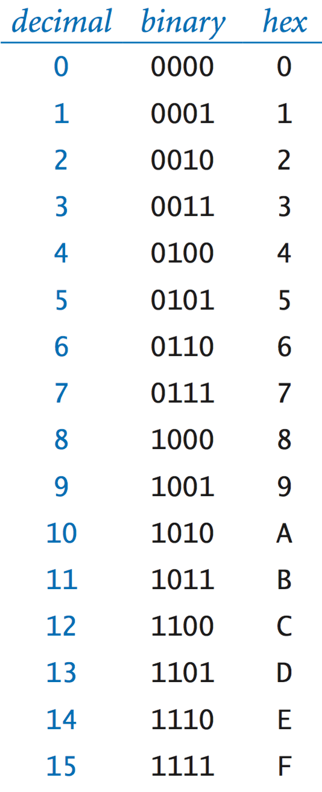
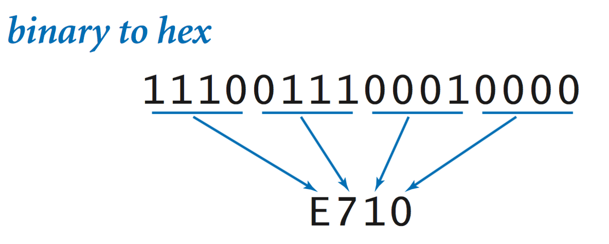
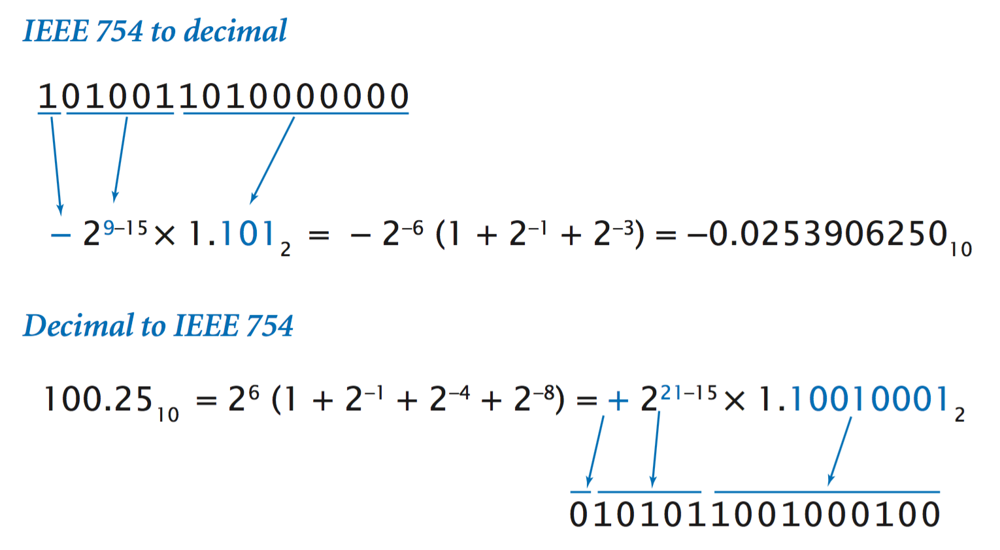

# Representing Information — Complete Notes

## 6.1 Representing Information

Everything suited for processing with digital computers is represented as a sequence of **0s and 1s**, whether it be numeric data, text, executable files, images, audio, or video. The meaning of a given sequence of bits depends on **context**. This section explains how to represent:

- Integers (binary, decimal, hexadecimal)
- Negative integers (two’s complement)
- Floating‑point numbers (IEEE 754)
- Characters (ASCII, Unicode)
- Bitwise operations, shifting, masking
- Endianness

---

# 1. Number Systems

## 1.1 Decimal
Decimal is **base 10**.  
A number \( d_n d_{n-1} \ldots d_0 \) means:
\[
d_n10^n + d_{n-1}10^{n-1} + \cdots + d_0 10^0
\]

**Example:**  
10345 = \(1·10^4 + 0·10^3 + 3·10^2 + 4·10^1 + 5·10^0\)

---

## 1.2 Binary
Binary is **base 2**; digits are **bits** (0 or 1).

A number \( b_n b_{n-1} \ldots b_0 \) means:
\[
b_n2^n + b_{n-1}2^{n-1} + \cdots + b_0
\]

**Example:**  
1100011₂ = 99

---

## 1.3 Hexadecimal
Hexadecimal is **base 16**, using digits 0–9 and A–F (A=10, B=11, ..., F=15).

A hex number \( h_n h_{n-1} \ldots h_0 \) means:
\[
h_n16^n + \cdots + h_0
\]

**Example:**  
FACE₁₆ = 64,206

---

# 2. Conversions

## 2.1 Hex ⇄ Binary

Because 16 = 2⁴, each hex digit corresponds to **4 bits**.

### Hex Table 0–F


---

## 2.2 Converting Binary → Hex
To convert: group bits in sets of 4 from the right.



---

## 2.3 Hex/Binary/Decimal Table (128–255)


---

## 2.4 Decimal → Base b (repeated division)

**Example: 366 → binary**

```
366 ÷ 2 = 183 r 0
183 ÷ 2 = 91  r 1
91  ÷ 2 = 45  r 1
45  ÷ 2 = 22  r 0
22  ÷ 2 = 11  r 0
11  ÷ 2 = 5   r 1
5   ÷ 2 = 2   r 1
2   ÷ 2 = 1   r 0
1   ÷ 2 = 0   r 1
```

Binary = **101101110₂**

---

# 3. Parsing and String Representation

- **Parsing:** converting a string → internal numeric form  
  Example: `parseInt("1101", 2)`

- **toString():** converting internal number → string  
  Example: `.toString(16)` → hex representation

`BinaryConverter.java` and `Converter.java` implement these conversions.

---

# 4. Integer Arithmetic

## 4.1 Addition
Same algorithm as grade-school addition, but base‑dependent. Carry occurs when digit ≥ base.

## 4.2 Unsigned Integers
An **n-bit unsigned integer** can represent:

\[
0 \text{ to } 2^n - 1
\]

Example: 16-bit unsigned → 0 to 65,535.

## 4.3 Overflow
Overflow occurs when result > max representable value.  
For **unsigned**, overflow is detected if carry from MSB occurs.

---

# 5. Multiplication
Grade-school multiplication works in binary and hex as well.

---

# 6. Negative Integers — Two's Complement

Two’s complement is used to represent negative values.

To compute −x:
\[
2^n - x
\]

**Example (4-bit):**

| Decimal | Binary |
|---------|--------|
| +5      | 0101   |
| –5      | 1011   | (because 16 − 5 = 11)

### Negation
Flip bits → add 1.

### Addition
Same as unsigned addition; overflow detection differs.

---

# 7. Floating‑Point (IEEE 754)

Floating point resembles **scientific notation**, but in **binary**:

\[
(\text{sign}) × (\text{coefficient}) × 2^{\text{exponent}}
\]

---

## 7.1 Anatomy of Floating‑Point Number (Binary16)
- 1 sign bit  
- 5 exponent bits  
- 10 fraction bits  

Exponent is stored in **offset binary** with bias:

\[
\text{bias} = 2^{t-1} - 1 = 15
\]

Example exponent bits: **10101₂**  
= 21 decimal  
Actual exponent = 21 − 15 = **6**

### Fraction
Binary fraction with implicit leading 1:  
Example: `1.101₂ = 1 + 2⁻¹ + 2⁻³ = 1.625`

---

## 7.2 IEEE 754 Anatomy Diagram


---

## 7.3 Converting FP ↔ Decimal


---

# 8. Bit Manipulation in Java

Java's `int` is a **32-bit two’s complement integer**.

Supported operations:

### 8.1 Complement
`~x` flips all bits.

### 8.2 Bitwise Logical Operators

| Op | Meaning |
|----|---------|
| &  | AND     |
| \| | OR      |
| ^  | XOR     |

### 8.3 Shifting
- `<<` shift left (fills with 0)
- `>>` arithmetic shift right (fills with sign bit)
- `>>>` logical shift right (fills with 0)

### 8.4 Shifting and Masking
Use to extract a subset of bits.

Steps:
1. Shift right  
2. AND with mask of k ones  

Example extracts bits 9–12 from 32-bit integer.

---

# 9. Characters

## 9.1 ASCII
7-bit encoding (commonly stored in 8-bit bytes).  
Example: Hex **4A** = `'J'`

## 9.2 Unicode
21-bit standard, encoded as **UTF‑8**, **UTF‑16**, or **UTF‑32**.  
UTF‑8 uses 1–4 bytes.

---

# 10. Endianness

Endianness defines byte order for multi‑byte values.

### Big Endian
Most significant byte first.  
Used by Java, macOS, PowerPC.

### Little Endian
Least significant byte first.  
Used by Intel processors.

**Example 16-bit value:**  
Binary: `0111000011110010`  
Hex bytes: `70 F2`

| Format       | Stored As |
|--------------|-----------|
| Big Endian   | 70 F2     |
| Little Endian| F2 70     |

---

# 11. References
- Sedgewick & Wayne, *Computer Science: An Interdisciplinary Approach*
- IEEE 754 Standard
- Oracle Java Documentation

